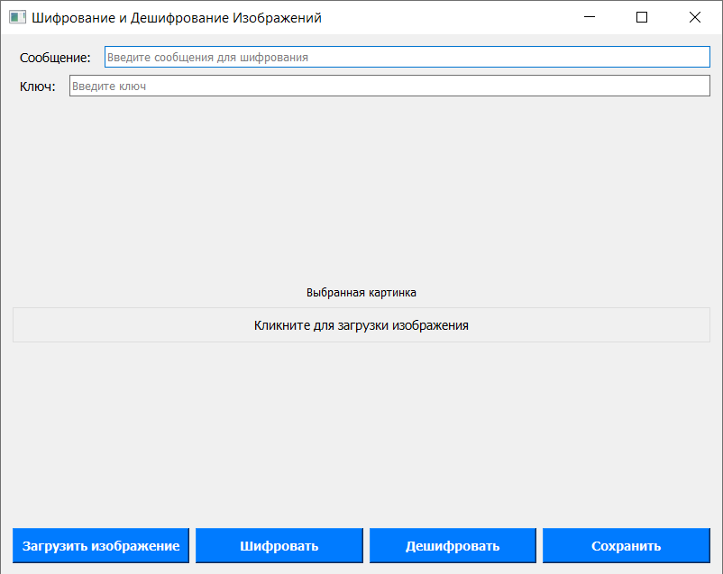

## Steganography hide message to iamge

Кодирование сообщения выполняется с использованием алгоритма **LSB**.

Сообщение также шифруется с использованием **AES_128 ECB**.

Интерфейс написан на PYQT:

